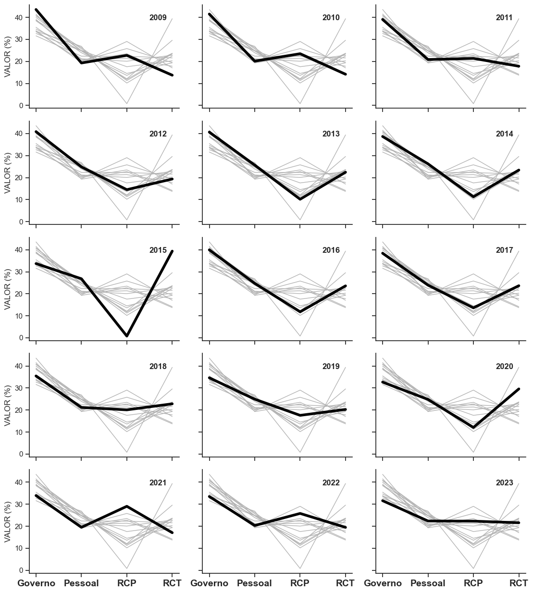
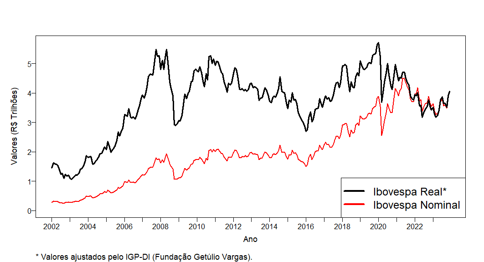
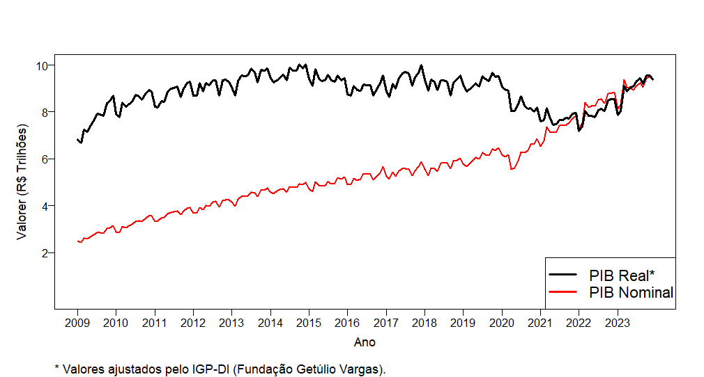
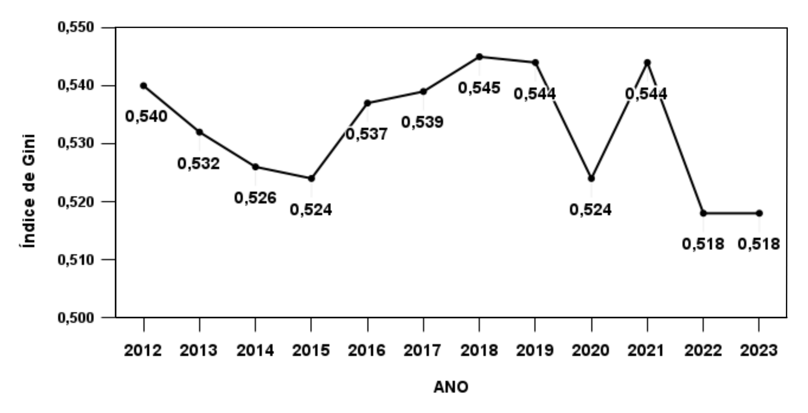
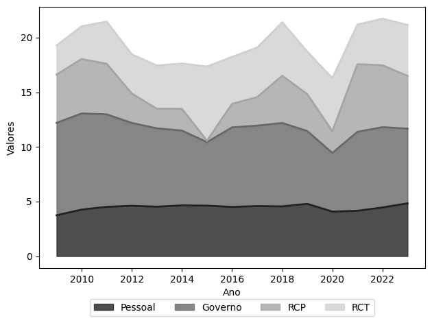
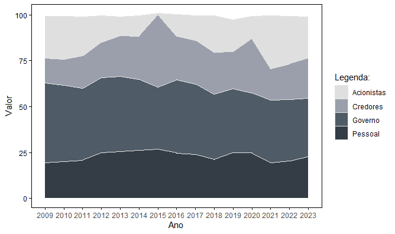

# Demonstração do Valor Adicionado - 2009 à 2023

Felipe Alves de Morais (2024)

## Série Temporal

*Fonte: elaboração própria.*

## Ibovespa

*Fonte: elaboração própria.*

## PIB de 2009 à 2023 - Ajustado pelo IGP-DI

*Fonte: elaboração própria.*

## Índice de Gini

*Fonte: elaboração própria.*

## Distribuição do VA: Pessoal, Governo, Acionistas, Credores

*Fonte: elaboração própria.*

## Distribuição do VA: Pessoal, Governo, Acionistas, Credores

*Fonte: elaboração própria.*